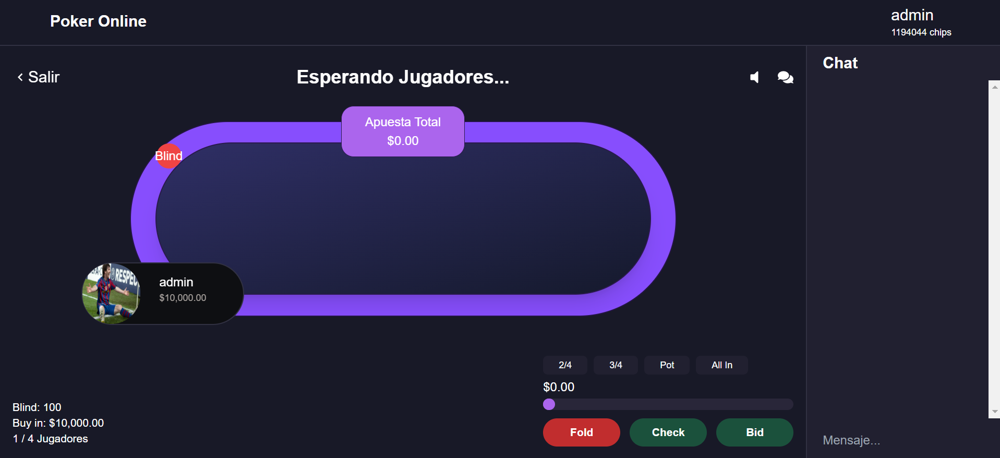
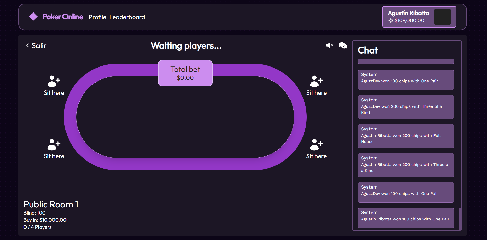

# Poker Online App

## Descripción

Bienvenido a **Poker Online App**, mi plataforma para jugar al póker con amigos y jugadores de todo el mundo. He diseñado esta aplicación para ofrecer una experiencia de juego fluida y emocionante, utilizando las últimas tecnologías web para garantizar un rendimiento óptimo y una interfaz de usuario atractiva.

## Tecnologías Utilizadas

- **TypeScript**: Para un desarrollo seguro y eficiente, con tipado estático.
- **NestJS**: Para el backend, proporcionando un robusto framework de Node.js con soporte para aplicaciones escalables.
- **NextJS**: Para el frontend, permitiendo una renderización rápida del lado del servidor y una experiencia de usuario dinámica.

## Funcionalidades

### Juego en Línea

- **Mesas de Juego**: Crea o únete a mesas de póker en línea y compite contra otros jugadores.
- **Modos de Juego**: Texas Hold'em.

### Gestión de Usuarios

- **Registro y Autenticación**: Regístrate fácilmente y accede con tu cuenta de usuario.

## Próximos Updates

Estoy trabajando en varias mejoras y nuevas funcionalidades para la aplicación. Aquí tienes un vistazo a lo que está por venir:

- **Sistema de Fichas Cada Cierto Tiempo**:
- **Traducir la Página**
- **Devolver el Sobrante de Fichas en el Win**

## Contribuir

Estoy abierto a contribuciones de la comunidad.

